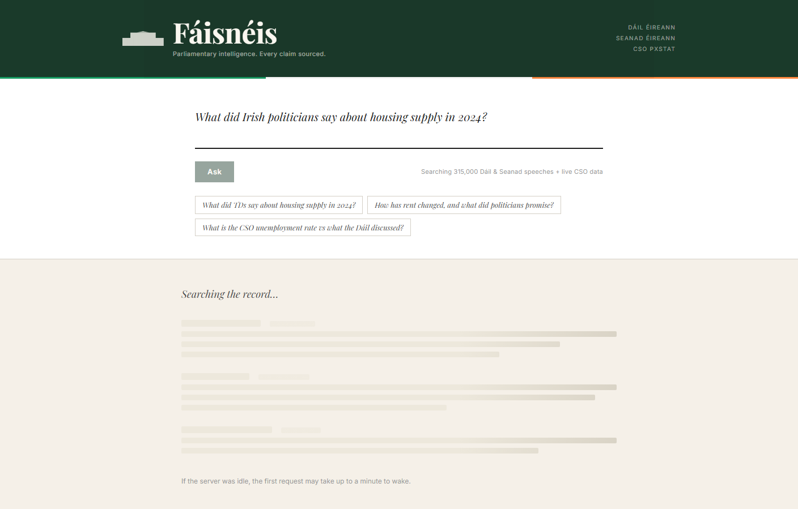
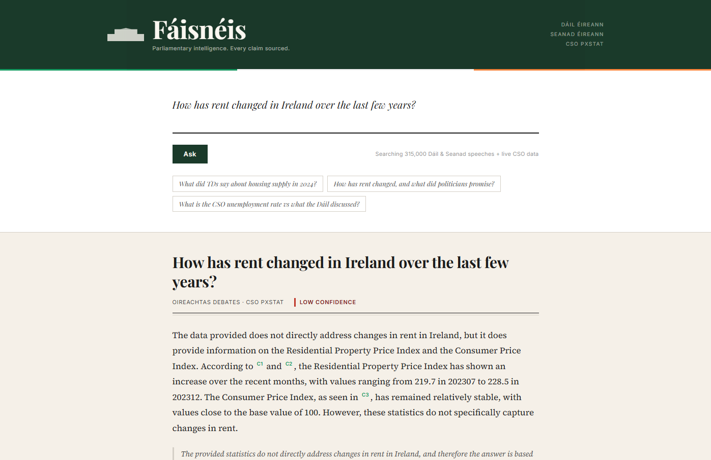
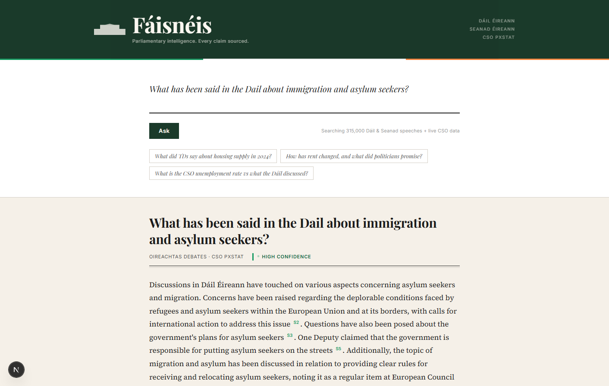
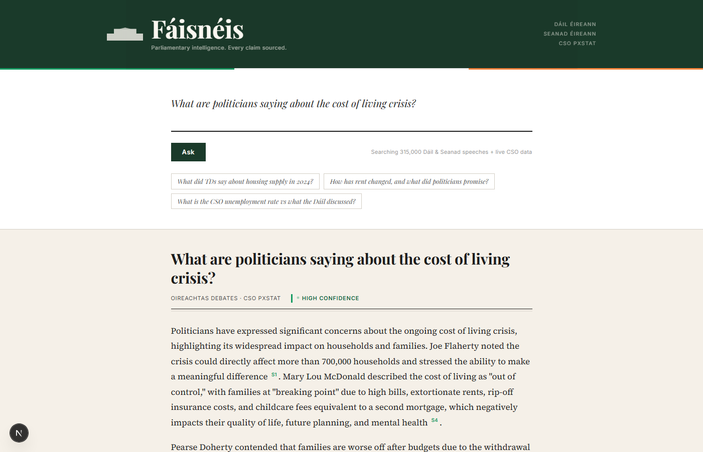
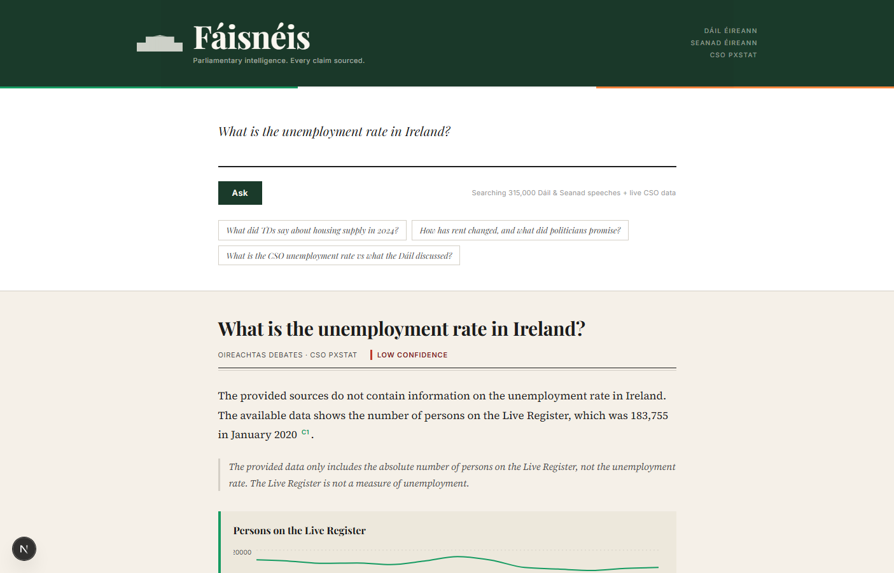
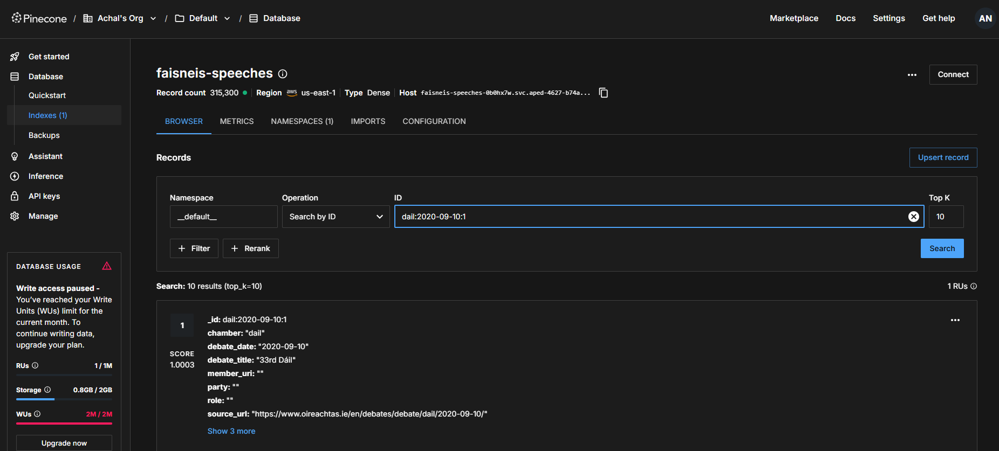
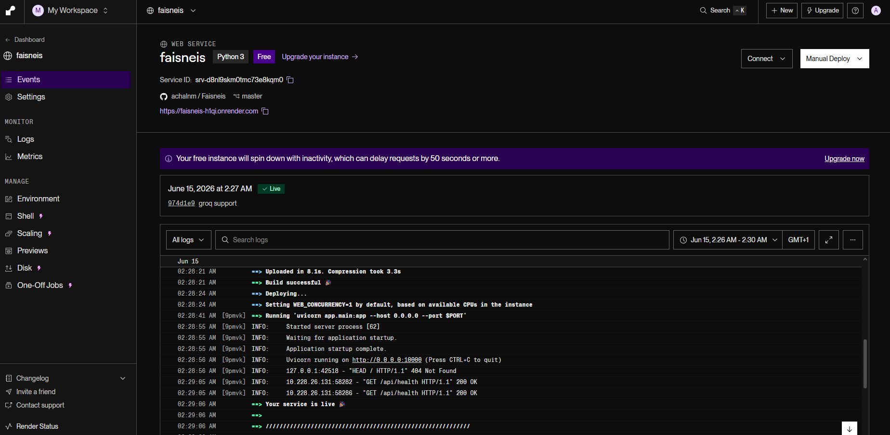
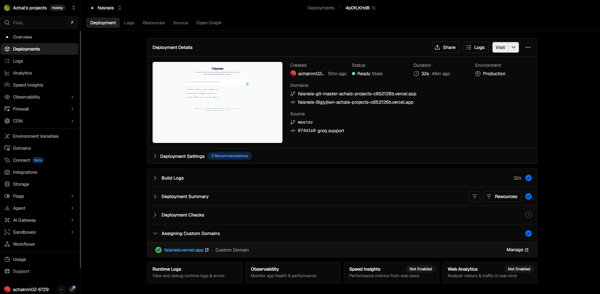

# Faisneis

An Irish parliamentary Q&A tool. Ask a question in plain English and get a cited answer drawn from Oireachtas debate transcripts and live CSO statistics.

Built as a personal project to make Dail debates more searchable and to cross-reference what politicians say with what the actual numbers show.

**Live:** [faisneis.vercel.app](https://faisneis.vercel.app)

---

## What it does

- Searches Dail and Seanad debates (XML transcripts, 2020 onwards) for relevant speeches
- Pulls live stats from the CSO for economic topics (inflation, rent, unemployment, etc.)
- Routes each question to the right data sources, then writes a cited answer
- Shows a chart when there is time-series data worth plotting
- Every quote and every number links back to its original source

Example questions to try:

- "What did Irish politicians say about housing supply in 2024?"
- "How often has the cost of living been raised in the Dail and what do the inflation figures show?"
- "What has the Minister for Finance said about employment?"

---

## Screenshots

### Asking about housing supply



Heather Humphreys and Michael McGrath both cited on the same question. Each [S1], [S2] marker is a clickable link back to the original Oireachtas debate.

### Rent trends



When a question has an economic angle the app pulls CSO data too. This one fetched the Residential Property Price Index and drew a chart alongside the political quotes.

### Immigration debates



Five TDs cited from different sessions - Paul Murphy criticising the Government for putting asylum seekers on the streets, Peter Burke on European Council discussions, others in between.

### Cost of living



Good example of cross-party coverage. Joe Flaherty, Pearse Doherty, Mary Lou McDonald, and Louise O'Reilly all quoted on the same topic from different dates and sessions.

### International students


A more niche subject that shows the search still finds relevant debates even when it's not a hot-button topic. Norma Foley, Simon Harris, and Colm Brophy all came up.

### CSO chart alongside the answer



When a question has a statistical angle the app fetches live CSO data and draws a chart. This one pulled the monthly unemployment series from CSO PxStat and plotted it next to the Dail speeches on the same topic.

---

### Infrastructure

### Pinecone - the vector index



315,300 speech chunks stored after ingesting Dail and Seanad transcripts from 2020 onwards. Each record has the speaker name, debate date, chamber, and a direct URL back to the Oireachtas website so every citation is traceable.

### Render - backend in production



The FastAPI backend running on Render's free tier. Logs show the ONNX embedding model getting pre-baked at build time, then uvicorn starting up and health checks passing.

### Vercel - frontend in production



Next.js frontend on Vercel with faisneis.vercel.app as the custom domain. 32 second build.

---

## Stack

| Layer | Tech |
| --- | --- |
| Frontend | Next.js, Tailwind CSS, Recharts (Vercel) |
| Backend | FastAPI, Python 3.12 (Render) |
| Vector store | Pinecone serverless |
| Embeddings | fastembed, all-MiniLM-L6-v2 (ONNX, no GPU) |
| LLM | Llama 3.3 70B via Groq |
| Data | Oireachtas Open Data API + CSO PxStat API |

---

## Running locally

### Backend

```bash
cd backend
pip install -r requirements.txt
cp .env.example .env
uvicorn app.main:app --reload --port 8000
```

### Frontend

```bash
cd frontend
npm install
npm run dev
```

Then open [http://localhost:3000](http://localhost:3000).

---

## Environment variables

Set these in `backend/.env`:

| Variable | Default | Notes |
| --- | --- | --- |
| `LLM_PROVIDER` | `groq` | `groq` or `gemini` |
| `GROQ_API_KEY` | | Required when using Groq |
| `GOOGLE_API_KEY` | | Required when using Gemini |
| `GROQ_MODEL` | `llama-3.3-70b-versatile` | |
| `PINECONE_API_KEY` | | Pinecone API key |
| `PINECONE_INDEX` | `faisneis-speeches` | Index name |
| `CACHE_DIR` | `./data/cache` | Local cache for API responses |

Frontend needs one variable in `.env.local`:

```env
NEXT_PUBLIC_API_BASE=http://127.0.0.1:8000
```

---

## Ingesting speeches

Run from `backend/`:

```bash
# test with a single month first
python -m app.ingest.run_ingest --chamber dail --date-start 2024-01-01 --date-end 2024-01-31

# full backfill
python -m app.ingest.run_ingest --chamber both
```

Re-running is safe, it skips speech IDs already in the index.

---

## API endpoints

`POST /api/ask` - main endpoint, streams SSE

```json
{ "question": "What did politicians say about housing supply?" }
```

`GET /api/health` - returns provider name and status

`GET /api/debug/speech-search?q=...` - test semantic search directly

`GET /api/debug/stats-search?q=...` - test CSO catalog matching

---

## Project structure

```text
backend/
  app/
    main.py         FastAPI app and SSE streaming
    config.py       settings via pydantic-settings
    schemas.py      request/response types
    agent/          router, synthesizer, LLM wrappers, pipeline
    retrieval/      Pinecone client and embeddings
    stats/          CSO API client, catalog search, jsonstat parser
    ingest/         Oireachtas XML parser and ingestion scripts
frontend/
  app/              Next.js pages and API client
  components/       AnswerView, SourcesPanel, StatChart
```

---

## Things that didn't work (notes to self)

**Hosting was a nightmare.** I originally tried Railway but anything with a persistent volume needs a paid plan. Tried Oracle Cloud free tier but the signup kept failing. Fly.io free tier is basically dead now. Koyeb showed $30/month upfront. Eventually landed on Render which is actually free with no card required, but it has a 512MB RAM limit which caused its own problems.

**sentence-transformers kept killing the server.** My first embedding setup used sentence-transformers + PyTorch. Worked fine locally but on Render it would crash after a few seconds with an OOM error. PyTorch alone is 400MB+. Switched to fastembed which uses ONNX runtime instead and brought memory down to a reasonable level.

**The CSO catalog search was unusably slow.** I originally embedded all 12,000+ CSO table titles at startup to find relevant stats for a query. On Render this took over 2 minutes on cold start. Replaced it with simple keyword matching which runs in under 0.1 seconds and is honestly just as accurate for this use case.

**Render's 30 second timeout.** The backend was taking 40-50 seconds to answer some questions. Render kills any request that doesn't start responding within 30 seconds. Fixed by switching the `/api/ask` endpoint to SSE (server-sent events) and sending a heartbeat comment every 5 seconds to keep the connection alive while the answer is being generated.

**SSE parser bug that took ages to find.** The frontend was parsing the SSE stream but randomly getting "stream ended without a result" errors. Turned out I was declaring the `eventType` and `dataLine` variables inside the while loop so they were reset on every iteration. When an event and its data arrived in different network chunks the parser lost the event type. Moving the declarations outside the loop fixed it.

**Gemini's free tier rate limit.** Gemini 2.5 Flash free tier allows 10 requests per minute. Fine for normal use but the moment I started running test batches it would hit the limit immediately. Switched to Groq which runs Llama 3.3 70B and gives 30 RPM and 14,000 requests per day on the free tier.

**Speaker name detection.** Querying for "what did the Minister for Finance say" was returning zero results because the code was trying to filter Pinecone by `speaker_name = "Minister for Finance"` which matched nothing. Had to add logic to detect when a "speaker" is actually a role title rather than a person's name, and skip the filter in that case.

---

## Data

Parliamentary debates from the [Houses of the Oireachtas](https://www.oireachtas.ie/en/open-data/) under the Open Data PSI Licence.

Statistics from the [Central Statistics Office](https://www.cso.ie). CSO Ireland.
